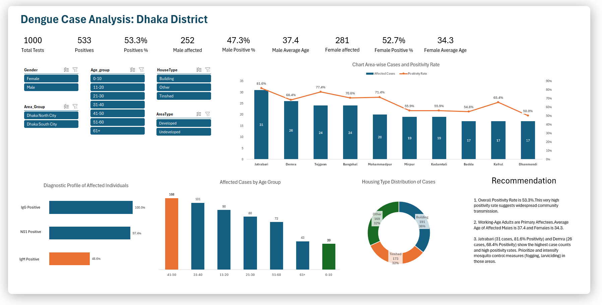

# 🦟 Dengue Case Analysis: Dhaka District

---

##  Overview
This dashboard provides a comprehensive analysis of dengue cases in the Dhaka District, based on 1,000 test results. The visualization highlights key statistics, demographic breakdowns, diagnostic profiles, and actionable recommendations for public health interventions.

---

##  Key Metrics
    --> Some of these may change based on the slicers.
- **Total Tests:** 1,000
- **Positives:** 533
- **Total Positivity Rate:** 53.3%
- **Total Male Affected:** 252 (47.3%, Avg. Age: 37.4) 
- **Total Female Affected:** 281 (52.7%, Avg. Age: 34.3) 
---

##  Slicers
- **Gender:** Male, Female
- **Age Groups:** 0-10, 11-20, 21-30, 31-40, 41-50, 51-60, 61+
- **Area Group:** Dhaka North City, Dhaka South City
- **House Type:** Building, Other, Tin Shed
- **Area Type:** Developed, Undeveloped

---

##  Visual Insights

### 1. **Area-wise Cases & Positivity Rate**
    --> These may change based on the slicers.
- **Jatrabari**: 31 cases, 81.6% positivity
- **Demra**: 26 cases, 68.4% positivity
- **Tejgaon, Bangshal, Mohammadpur**: 24 cases each
- **Other Areas**: Mirpur, Kadamtali, Badda, Kafrul, Dhanmondi (17-20 cases each)

### 2. **Diagnostic Profile**  
    --> These may change based on the slicers.
- **IgG Positive:** 100%
- **NS1 Positive:** 97.4%
- **IgM Positive:** 48.6%

### 3. **Affected Cases by Age Group**
    --> These may change based on the slicers.
- Highest: 41-50 (108 cases), 31-40 (101), 11-20 (90)
- Children (0-10): 39 cases

### 4. **Housing Type Distribution**
    --> These may change based on the slicers.
- **Building:** 191 cases (36%)
- **Tin Shed:** 173 cases (32%)
- **Other:** 169 cases (32%)

---

##  Insights
1. **High Positivity Rate:**
   - The overall positivity rate is 53.3%, indicating widespread community transmission.
2. **Target Working-Age Adults:**
   - Most affected are working-age adults. Average age: Males 37.4, Females 34.3.
3. **Focus on Hotspots:**
   - Jatrabari and Demra have the highest case counts and positivity rates. Prioritize mosquito control (fogging, larviciding) in these areas.

---

---

##  Author
- **Shawon Mandal**  
> [LinkedIn Profile](https://www.linkedin.com/in/shawon-mandal-160440260/)

---

> _For more details, see the dashboard image above and the Excel data file._
